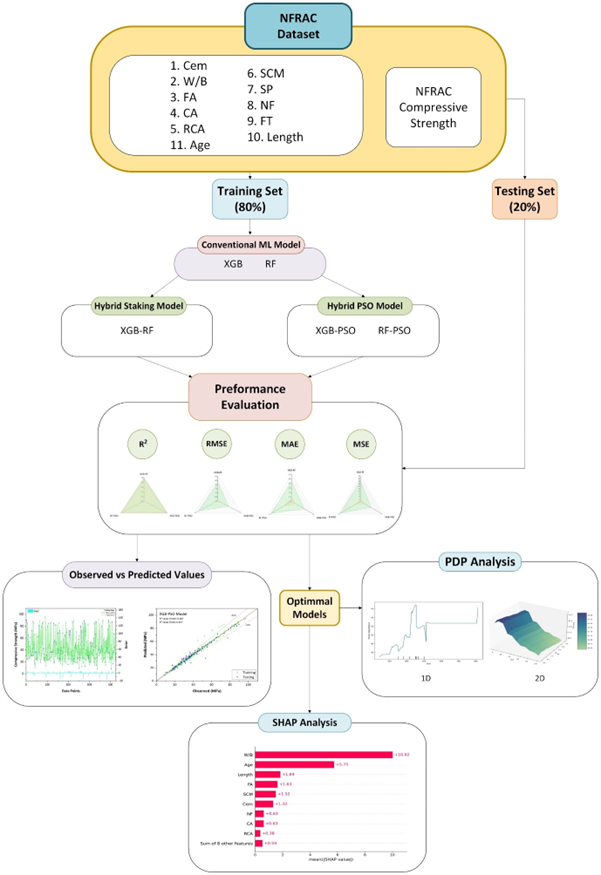

# Hybrid-Machine-Learning-Prediction-of-Concrete-Properties-including-SHAP-PDP-analysis

<p align="center">
  
</p>

The following codes provide prediction of concrete compressive strength using hybrid machine learning models with SHAP and PDP analysis

This repository contains the code, data, and documentation for the research article titled **"Hybrid Machine Learning Based Prediction of Compressive Strength of Natural Fiber Recycled Aggregate Concrete: Incorporating SHAP and PDP Analysis."** The study focuses on using hybrid machine learning models to predict the compressive strength of concrete that incorporates natural fibers and recycled aggregates, contributing to sustainable construction practices.

## Abstract
The study aims to decarbonize concrete manufacturing by utilizing natural resources, specifically natural fibers and recycled aggregates. We developed hybrid machine learning models (XGB-RF, RF-PSO, and XGB-PSO) to predict the compressive strength of Natural Fiber Recycled Aggregate Concrete (NFRAC) based on 534 data points. The models are evaluated using statistical metrics, and SHAP and PDP analyses are used to interpret the significance of key variables.

## Repository Structure

- `data/`: Contains the dataset used for training and testing the machine learning models.
- `notebooks/`: Jupyter notebooks with the code for data preprocessing, model training, and evaluation.
- `results/`: Contains the output files, including model predictions and SHAP/PDP visualizations.
## Requirements

To run the code in this repository, you will need to install the following dependencies:

- Python 3.x
- NumPy
- Pandas
- Scikit-learn
- XGBoost
- Matplotlib
- SHAP
- PDPbox
## Additional Softwares used
### OriginPro

You can install the required packages using the following command:

```bash
pip install -r requirements.txt
